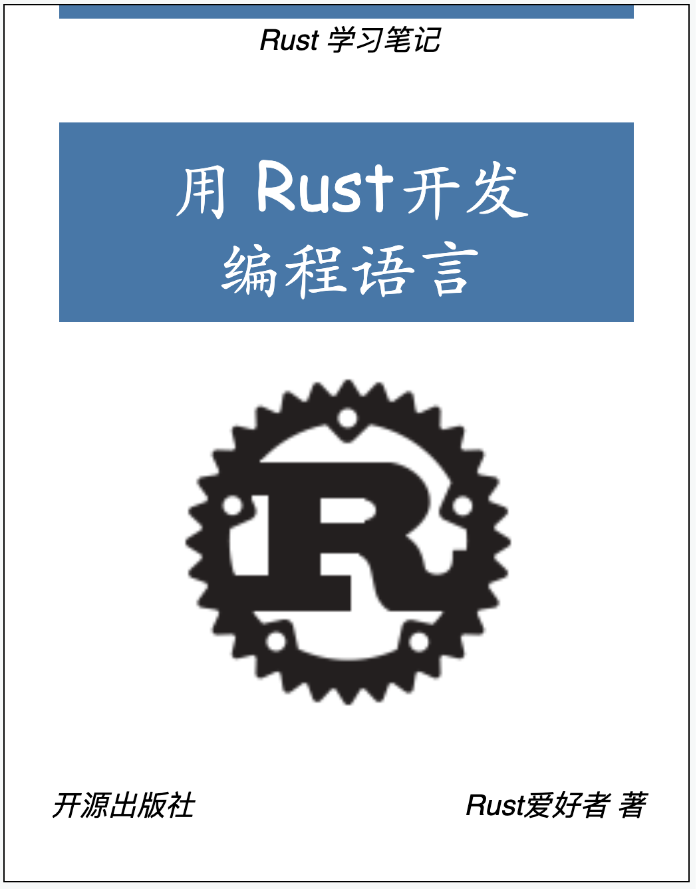

# 用 Rust 开发编程语言

引个流先：

- *KusionStack一站式可编程配置技术栈(Go实现): <https://github.com/KusionStack/kusion>*
- *KusionStack内置的KCL配置语言(Rust实现): <https://github.com/KusionStack/KCLVM>*

## 序言

写这个电子书是因为最近在做 KusionStack、KCLVM 项目中编译器研发的相关工作，发现虽然编译器的基本原理不变，但是将学校中学习的内容应用在工作中开发编译器还远远不够，想要创造一种新的编程语言不仅仅需要了解编译原理，还需要了解与编译器相关的整个周边生态，因此，在[柴大](https://github.com/chai2010)的建议下打算开一个坑，通过一个玩具语言 Tiny-Lang，将整个语言编译生态的开发过程串联起来，使用Rust语言开发一个完成的编译工具集。

KCLVM 是我们在 Kusion 这个项目中使用 Rust 开发的语言编译器，书中的部分内容在这个项目中也有对应的应用。对云原生生态、技术感兴趣的同学可以了解下  &#x1F449; [KusionStack](https://github.com/KusionStack/kusion) 这个项目；对 Rust、编程语言、编译器感兴趣的同学可以看下 &#x1F449; [KCLVM](https://github.com/KusionStack/KCLVM)。

最后，这些文章中的内容大部分是我在日常开发过程中进行的总结和凝练，本人水平有限，所以可能会有一些不准确甚至错误的地方，也欢迎大家提 PR/Issue/Discussion，或者下方扫码加群讨论。如果对 Rust 源码有自己分析和见解，同样欢迎提 PR 投稿。

---

## 电子书

目标：使用 Rust 为一个玩具语言 Toy-Lang 开发一个完整的编译工具生态。

- 代码仓库: [https://github.com/awesome-kusion/rust-toy-lang-book](https://github.com/awesome-kusion/rust-toy-lang-book)
- 在线阅读: [https://awesome-kusion.github.io/rust-toy-lang-book](https://awesome-kusion.github.io/rust-toy-lang-book)

## 目录

[用 Rust 开发编程语言](index.md)

[前言](./pre/preface.md)

- [最小编译器](./ch1/readme.md)
  - [最小编译器](./ch1/ch1-01-mini-compiler.md)
  - [加减法表达式](./ch1/ch1-02-add-sub.md)
  - [乘除法表达式](./ch1/ch1-03-mul-div.md)
  - [解析表达式语法树](./ch1/ch1-04-parser.md)

- [Tiny-Lang]()
- [编译器的基建]()
    - [基建都包括什么]()
    - [输入系统]()
    - [文件系统]() 
    - [错误处理系统]()
- [词法解析详解]()
    - [词法分析]()
    - [写一个词法分析器]()
    - [词法分析器结构优化]()
    - [词法分析器的生成]()
    - [输入系统与词法分析器的测试]()
- [语法分析]()
    - [上下文无关语法]()
    - [LL(1), LR, LALR]()
    - [自顶向下的语法分析]()
    - [用递归下降实现自顶向下的语法分析]()
    - [递归下降语法分析结构优化]()
    - [递归下降分析器的生成]()
    - [自底向上的语法分析]()
    - [用压栈式有限自动机实现自底向上的语法分析]()
    - [压栈式有限自动机结构优化]()
    - [压栈式有限自动机生成器]()
    - [自顶向下 vs 自底向上]()
    - [语法分析器的测试]()
    - [扩展：部分自然语言处理的算法也可以应用于语法分析]()
- [抽象语法树]()
    - [抽象语法树设计]()
    - [抽象语法树结构优化]()
    - [抽象语法树生成器]()
    - [抽象语法树结合语法分析过程]()
    - [抽象语法树的测试]()
- [符号表与语义分析]()
    - [符号表与类型系统]()
    - [实现类型检查器]()
    - [类型检查器的优化]()
    - [类型检查器生成器]()
- [代码生成]()
    - [中间语言 & 中间语言虚拟机]()
    - [Runtime]()
    - [LLVM]() 
    - [WASM]()
- [增量编译]()
    - [什么是增量编译]()
    - [增量编译 vs 遍历编译]()
    - [基于遍历的编译过程向增量编译改造]() 
- [编译器的性能优化]()
    - [编译时性能提升]()
    - [运行时性能提升]()
    - [生成代码的优化]()
- [编译器的打包与发布]()
- [编译器工具]()
    - [多语言API]()
    - [lint]()
    - [UI test]()
    - [bench]()
    - [fuzz]()
    - [IDE]() 
- [成果验收]()
    - [用 Tiny-Lang 实现冒泡排序]()
    - [用 Tiny-Lang 递归实现斐波那契数列的计算]()
    - [用 Tiny-Lang 自举为Tiny-Lang增加一个特性]()

- [附录](./appendix/readme.md)

---

