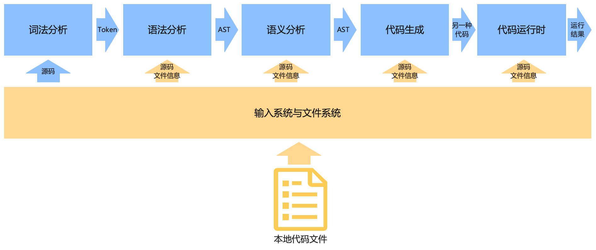
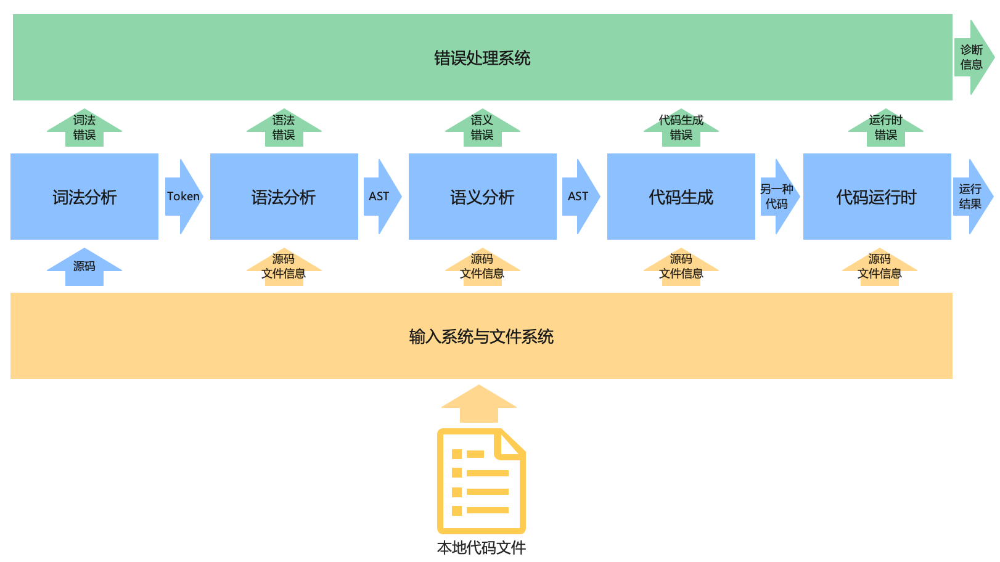
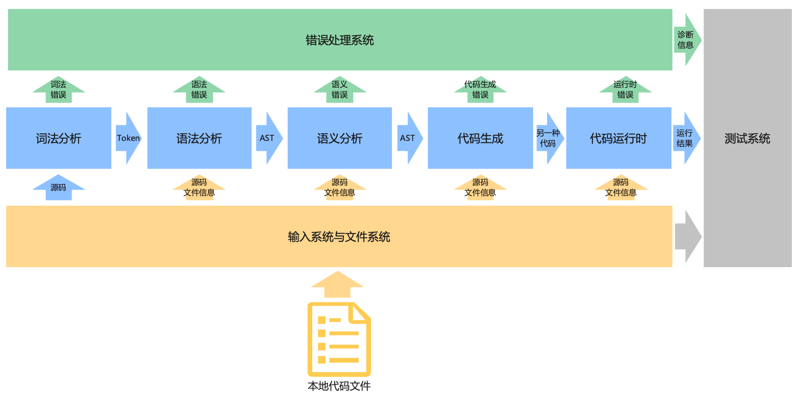
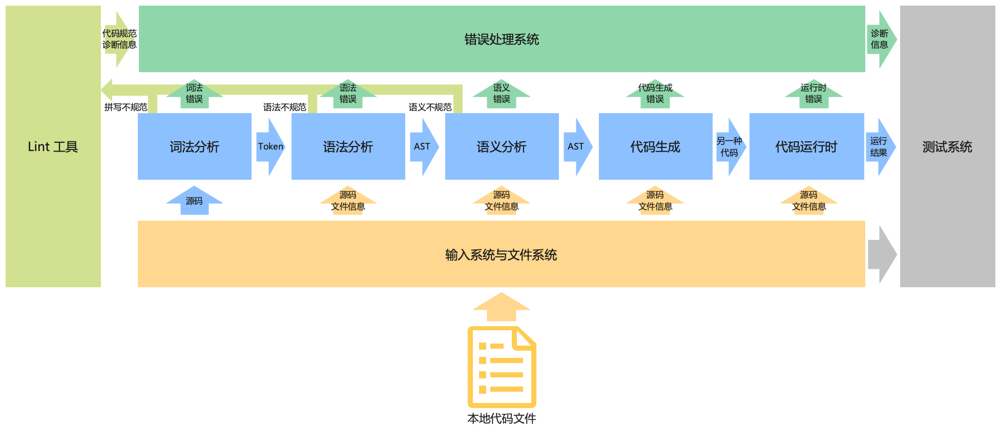
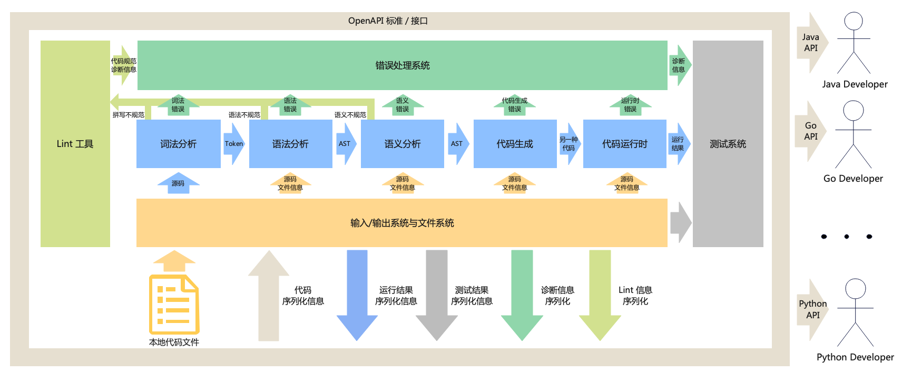
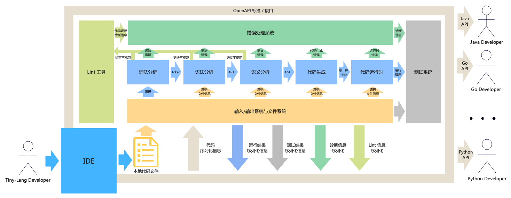

# 前言

本书的主题是以一个玩具语言 Toy-Lang 为线索，带领大家通过Rust语言实现一个完整的语言编译器生态。本书不仅仅包含通过Rust实现编译原理中词法语法分析，语义分析和代码生成的部分，还包含文件系统，错误处理，lint工具，IDE，性能优化等等编译器的周边生态，本书的最终目标不是将一门语言编译到另一门语言，最终目标是要围绕 Toy-Lang 完成一个完整的语言工具集，这个过程道阻且长，因此我们希望能有更多对相关内容感兴趣的小伙伴参与进来，与我们一同完成这个过程。

# 编译器

编译器的主要作用是将一种编程语言的代码翻译成另一种语言的代码，并交由另一种语言代码的虚拟机执行(IR、WASM、汇编都可以理解为另一种语言的代码)，主要过程如下图所示：

主要涉及词法分析，语法分析，语义分析，代码生成和代码运行时等过程，其中

- 词法分析主要用来将字符串中的单词分割开，并且为每个单词添加标签来为这个单词分类，分类后的每个单词称为Token。
- 语法分析主要用来根据语法规则分析Token流，根据语法规则与实际接受到的Token流对程序的结构进行分析，并生成全语法树(FST)或者抽象语法树(AST)。
- 语义分析主要用来检查程序是否正确，因此需要根据语义规则与语法树，遍历整个语法树对程序的各个部分进行检查。
- 代码生成，通过遍历语法树并在通过每个语法节点的时候，生成对应的代码。
- 代码运行时，通过借助已有生成语言的虚拟机或者为中间语言实现虚拟机，执行生成代码。

# 编译工具的生态

通过上一章的内容，我们介绍了编译原理中提到的编译器的主要组件，但是在实际使用过程中，仅仅包含上述过程是远远不够的，本章我们将主要介绍一个完整的编译生态中常见的一些重要组成部分。

## 输入与文件系统

编译器的主要输入是代码，在代码规模比较小的情况下，在加载文件阶段可以直接将所有的代码加载到一个字符串中进行分析，但是在代码规模比较大，并且代码包含多个代码文件的时候，直接加载到一个字符串中就可能会产生诸如加载多个大文件的性能损耗，代码在源文件中的无法定位等问题。因此，我们需要构建一个文本输入系统与文件管理系统来帮助我们的编译器快速有效的加载与组织源代码，并且能够为编译器的各个阶段高效快速的提供代码与源文件间相关的信息。如下图所示：

## 错误处理系统

编译器在编译源代码的各个阶段都要有应对错误的能力，毕竟代码是交给开发者写的，编译器即使遇到错误的代码也应该有所输出，最起码要告诉编程人员哪里的代码出了问题，并且这个问题导致了哪些其他问题的产生，一个优秀的错误处理系统能够帮助开发人员在使用编程语言的过程中事半功倍。因此，我们需要一个错误处理系统来帮助我们将编译器在各个阶段遇到的错误及时有效的传递给编程人员，如下图所示：

## 测试工具

不仅仅是编译器，任何程序的开发都应该包含测试，为了能够提升编译器的稳定性，我们需要开发一个测试工具用来帮助我们进行编译器各个部分的测试工作。

编译系统的测试主要包括UI Test, Bench, Fuzz三个过程。

- UI Test: 端到端测试，直接对比编译器各个部分的输出结果与期望的输出结果。
- Bench: 性能测试，主要包括编译过程的性能测试与运行时的性能测试。
- Fuzz：模糊测试，基于特定的语料库随机生成大量的测试用力对编译器前端进行冒烟测试，以提升编译器的稳定性。

## Lint工具

编译器负责将一种语言翻译成另一种语言，Lint 则负责规范语言的编写格式，一个优秀的lint工具能够让用户写代码的速度事半功倍，用户不再需要拘泥于缩进有几个空格，是否需要换行等等问题，只需要专注的写好代码中的逻辑，Lint工具会自动帮助用户完成格式上的调整。

## OpenAPI

编译器除了要考虑直接获取文件并读取源码之外，还需要考虑非本地文件输入的情况，在很多情况下，其他语言的开发者可能需要从代码侧对编译器的编译分析功能进行调用，因此我们还需要为我们的语言编译器提供可扩展多语言API的能力，注意，这里并不是我们自己实现这些OpenAPI，因为个人的能力有限，为全部的语言实现API是不现实的，我们只需要提供API的标准以及扩展API的能力，剩下的工作可以交给API的调用者去实现。

## IDE

都2202年了，应该没人直接用 txt 文本编辑器写程序了吧，IDE作为编程人员必备的工具之一，他不仅仅局限于一个独立的应用程序，他也可以是vscode 插件，vim插件之类的文本编辑器插件，通过与文本编辑器或者云 IDE 的快速集成，能够简单快速的获取一种编程语言的集成开发环境。

## 更多
除了上述编译器生态，我们还希望在整个过程中提供诸如编译器日志管理，编译器缓存，插件扩展等编译器的增强功能。

# 我们的目标
本书的最终目标是围绕一种玩具语言 Toy-Lang 实现上述整个编译生态完整的工具集。

